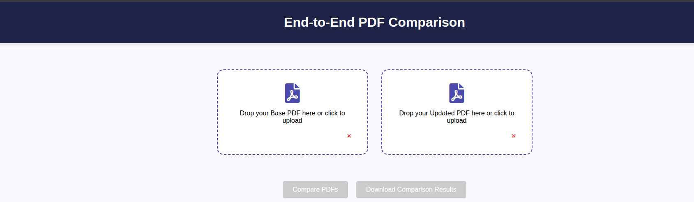
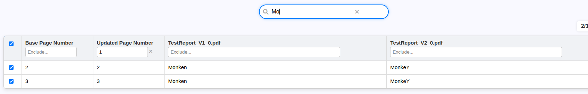
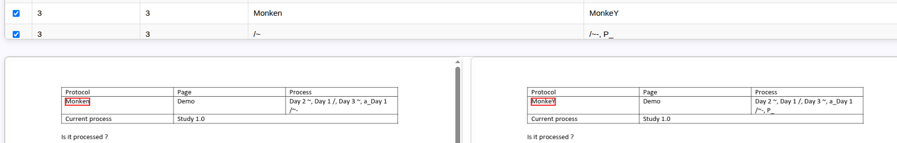

# 📄 PDF Comparer Application

## 🔍 Overview

The **PDF Comparer Application** enables users to:

- Upload **two PDF files** and compare them using the `pdf-diff` tool.
- **View or download** the resulting comparison PDF.
- Optionally display all **text differences in a table**:
  - Each row links to the corresponding PDF page.
  - Changes are highlighted in **red boxes**.

### ✨ Additional Features

- 🔎 **Search** results using keywords.
- 🚫 **Exclude** specific words from results using pipe-separated values (e.g., `M | Trial | 1`).
- ✅ **Select/Unselect** rows from the difference table.
- 📤 **Export selected rows** as an Excel file.

---

## 🛠️ Tech Stack

- **Language**: Python `3.11.0`
- **Comparison Tool - Modified Original Source**: [`pdf-diff`](https://github.com/JoshData/pdf-diff)

---

## ⚙️ Requirements

Make sure you have the following before running the app:

- `pdf-diff` installed and added to your system `PATH`.
- Logging configuration defined in `logging_config.py`.

---

## 🖼️ Screenshots

### 🔹 Landing Page  

### 🔹 Compared Result with Table  

### 🔹 Search Results  

### 🔹 Highlighted Changes in PDF  

